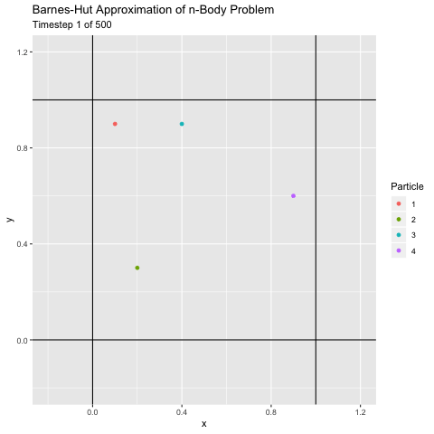

# [Barnes-Hut Approximation](https://en.wikipedia.org/wiki/Barnes%E2%80%93Hut_simulation) for n-Body Particle Simulation

### Project Overaview

This project implements an O(n log n) approximation to the typically O(n2) n-Body simulation. It uses a quadtree data structure to separate the problem space into cells. When particles are sufficiently far away (tunable by a constant), the force calculation is approximated using a tree node containing several particles instead calculating the force for each individual particle.

### Visualization

I animated a simple example with 4 particles using ggplot and gganimate in R to check that the behavior looks normal.

### Interesting Implementation Notes

1. Center of Mass and Total Mass Calculation
	* I updated the center of masses after each particle was added

2. Fx and Fy
	* I implemented Fx and Fy as floats within the struct Particle, but one could also use two pointers to floats that you could pass as function arguments

### Performance Evaluation

Performance Comparison for 1000 Iterations.

| Type | 100 Particles | 400 Particles | 900 Particles | 1600 Particles |
| --- | --- | --- | --- | --- |
| Theta = 0 (Complete n^2 Version) | 0.429 | 5.91 | 9.39 | 91.7 | 
| Theta = .25 | .328 | 2.45 | 7.87 | 15.8 |
| Theta = .5 | .220 | 1.176 | 3.11 | 6.24 | 
| Theta = .75 | .173 | .819 | 1.96 | 3.95 |

We can see in the O(n^2) version, an 4x increase in particles results in a 16x increase in runtime, as expected.

In the approximation versions, we get a noticeable speedup and see that is clearly better than O(n^2).